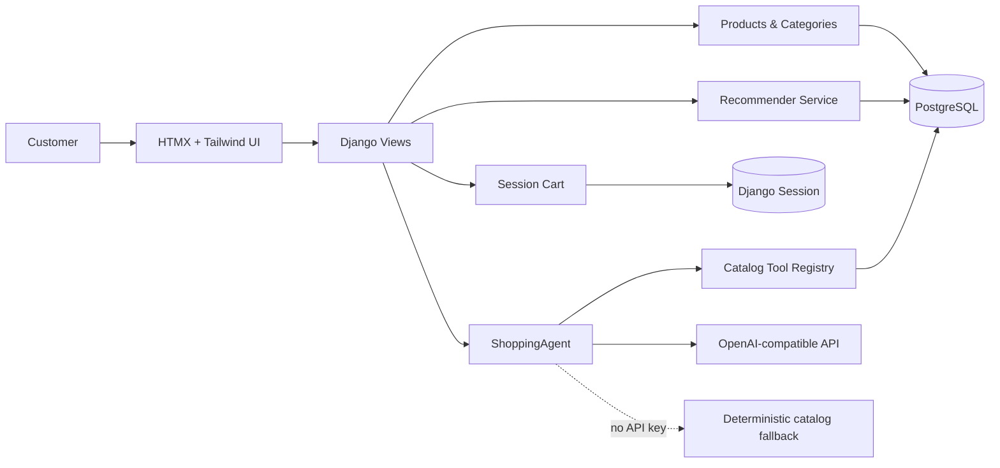

# SmartShop AI

> A catalog-grounded shopping assistant built with Django, HTMX, PostgreSQL, and an explainable content-based recommender.

[](https://www.djangoproject.com/)
[](https://www.python.org/)
[](https://www.postgresql.org/)
[](https://htmx.org/)
[](https://platform.openai.com/docs/guides/function-calling)
[](https://pytest.org/)
[](https://docs.docker.com/compose/)

## Overview

SmartShop AI is a portfolio-ready e-commerce MVP that demonstrates how to combine a conventional Django domain model with grounded AI behavior. The assistant does not invent product facts: it queries catalog tools for product search, authoritative details, comparisons, and similar-item recommendations. A deterministic recommender provides explainable ranking using category, brand, price, rating, and structured specifications.

The interface is server-rendered and progressively enhanced with HTMX, keeping the application simple to deploy while still providing responsive search, cart updates, recommendations, and chat interactions.

## Architecture



### AI tool-calling loop

1. A customer submits a message to `POST /agent/chat/`.
2. `ShoppingAgent` validates the message and sends a constrained system prompt plus tool schemas to the configured OpenAI-compatible model.
3. The model may request one of four read-only catalog tools.
4. The tool registry executes database-backed queries and returns structured JSON.
5. The model receives the tool result and produces a catalog-grounded answer.
6. If no API key is configured, the deterministic fallback responds directly from the catalog.

## Key Features

- **Grounded shopping assistant:** product facts, prices, stock, comparisons, and recommendations come from database-backed tools.
- **Explainable recommender:** weighted content similarity based on category, brand, price, rating, and JSON specifications.
- **Personalized recommendations:** purchase history is used when available; new users receive a highly-rated in-stock fallback.
- **HTMX interaction model:** search, filtering, cart actions, and assistant chat update focused page fragments without full refreshes.
- **Transactional inventory:** order creation uses `transaction.atomic()` and row locks to protect stock updates.
- **Robust settings hierarchy:** development, test, and production settings are separated; tests use in-memory SQLite while Docker development uses PostgreSQL.
- **Defensive AI boundary:** bounded messages, normalized tool arguments, malformed tool-call handling, a three-round tool loop, and a 30-second upstream timeout.
- **Credential-safe architecture:** secrets are environment-provided, `.env` is ignored, and no credential is embedded in application code or documentation.
- **Repeatable catalog seeding:** `seed_catalog` creates demo categories, brands, and products without duplicate seed records.

## Technology Stack

| Layer | Technology |
| --- | --- |
| Application | Django 5.x, Python 3.12+ |
| Persistence | PostgreSQL 16 in Docker; SQLite `:memory:` for local tests |
| UI | Django templates, HTMX, Tailwind CSS CDN |
| AI | OpenAI-compatible Chat Completions with function/tool calling |
| Recommendations | Deterministic content-based ranking |
| Runtime | Docker Compose, Gunicorn dependency included |
| Quality | Pytest, pytest-django, factory_boy, Ruff |

## Quickstart

### Option A: local tests without PostgreSQL

The test suite is intentionally independent of Docker and PostgreSQL. `pytest.ini` selects `core.settings.test`, which uses an in-memory SQLite database.

```bash
python -m venv .venv

# Windows
.venv\Scripts\activate

# macOS/Linux
# source .venv/bin/activate

python -m pip install -r requirements.txt
python -m pytest -q
python -m ruff check .
```

Expected verification:

```text
8 passed
All checks passed!
```

### Option B: full-stack Docker development

Prerequisites: Docker Desktop and Docker Compose.

```bash
copy .env.example .env       # Windows
# cp .env.example .env       # macOS/Linux

docker compose up -d --build
docker compose exec web python manage.py migrate
docker compose exec web python manage.py seed_catalog
```

Open `http://localhost:8000`. Useful operational commands:

```bash
docker compose ps
docker compose logs -f web
docker compose exec web python manage.py check
```

For local execution outside Docker, set `POSTGRES_HOST=localhost` in `.env` and ensure PostgreSQL is running. The normal application settings use PostgreSQL; only the automated test settings use SQLite.

## Environment Configuration

Copy `.env.example` to `.env` and replace placeholders with environment-specific values. Never commit `.env`.

| Variable | Purpose |
| --- | --- |
| `DJANGO_SETTINGS_MODULE` | Settings profile, normally `core.settings.dev` for local development |
| `DJANGO_SECRET_KEY` | Django signing key; required and non-default in production |
| `DJANGO_DEBUG` | Explicit debug switch; production settings force `False` |
| `DJANGO_ALLOWED_HOSTS` | Comma-separated host allowlist |
| `POSTGRES_DB` / `POSTGRES_USER` | Database identity |
| `POSTGRES_PASSWORD` | Database credential; use a strong deployment secret |
| `POSTGRES_HOST` / `POSTGRES_PORT` | Database network location |
| `AGENT_API_KEY` | Optional provider credential; blank selects the safe catalog fallback |
| `AGENT_BASE_URL` | Optional OpenAI-compatible API base URL |
| `AGENT_MODEL` | Configured chat model name |

Do not paste real credentials into issues, pull requests, README examples, or logs.

## Application Surface

| Method | Route | Purpose |
| --- | --- | --- |
| `GET` | `/` | Product catalog, search, category filter, and recommendations |
| `GET` | `/products/<slug>/` | Product details and similar products |
| `GET` | `/cart/` | Session cart |
| `POST` | `/cart/add/<id>/` | Add an in-stock product |
| `POST` | `/cart/update/<id>/` | Update cart quantity |
| `POST` | `/cart/remove/<id>/` | Remove a product |
| `GET` | `/recommendations/for-you/` | Authenticated personalized recommendations |
| `GET` | `/recommendations/similar/<slug>/` | Similar products; JSON when requested |
| `POST` | `/agent/chat/` | Catalog-grounded shopping assistant |
| `GET` | `/admin/` | Django admin entry point |

## Engineering Highlights

### Catalog grounding

The agent can only access a small, explicit registry:

- `search_catalog(query, max_price=None, category=None, limit=5)`
- `get_product_info(slug)`
- `compare_products(slugs)`
- `get_recommendations_for_product(slug, limit=3)`

Every tool reads current catalog data and serializes price, stock, taxonomy, ratings, and specifications. Missing products return `None` or an empty collection rather than fabricated facts.

### Defensive boundaries

- Empty messages and messages over 2,000 characters are rejected.
- Agent requests receive a lightweight one-request-per-second cache-backed rate limit.
- LLM calls use an explicit 30-second timeout.
- Malformed tool JSON and invalid tool arguments are converted to safe structured errors.
- Search, comparison, and recommendation tools normalize bad limits, prices, slugs, and query values.
- CSRF middleware protects state-changing requests and HTMX forms send CSRF headers.

### Configuration hierarchy

```text
core/settings/base.py   shared Django and PostgreSQL configuration
core/settings/dev.py    explicit local development profile
core/settings/test.py   isolated in-memory SQLite test profile
core/settings/prod.py   fail-closed production secrets and transport security
```

## Quality Checks

Run the same checks used for portfolio verification:

```bash
python -m pytest -q
python -m ruff check .
python manage.py check --settings=core.settings.test
```

Current baseline: **8 tests passing** and **Ruff clean**.

## Project Layout

```text
apps/
├── accounts/       custom user model
├── products/       catalog, categories, brands, seed command
├── cart/           session cart and HTMX endpoints
├── orders/         transactional order services and models
├── recommender/    explainable content-based ranking
└── agent/          ShoppingAgent, tools, and chat endpoint
core/
├── settings/       base, dev, test, and prod profiles
└── urls.py         root routing
templates/          page templates and HTMX partials
tests/              service and integration-oriented pytest coverage
docs/PRD.md         product requirements and roadmap
```

## Scope and Roadmap

This repository focuses on the catalog, discovery, cart, order service, recommender, and shopping-assistant MVP. Payment processing, fulfillment, customer-facing authentication screens, and production observability remain natural next increments rather than implied shipped capabilities.

Recommended next investments:

1. Add HTTP/client and negative-path coverage for all HTMX and agent endpoints.
2. Add structured agent telemetry with redaction and cost tracking.
3. Introduce recommendation evaluation fixtures and performance benchmarks.
4. Separate production Compose deployment from the development `runserver` workflow.

## License

This project is a portfolio/demo codebase. Add a project-specific license before public distribution.
