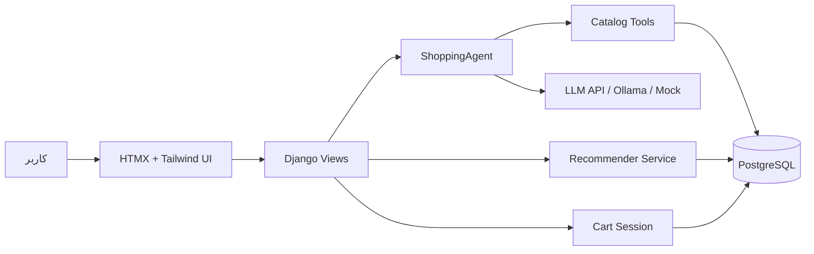

# SmartShop AI

## AI-Powered E-Commerce with Tool-Calling Agent & Content-Based RS

SmartShop AI یک فروشگاه اینترنتی ماژولار برای محصولات دیجیتال است که تجربه کشف و خرید را با یک Shopping Assistant متصل به کاتالوگ ترکیب می‌کند. ایجنت با Tool Calling به داده‌های واقعی محصولات دسترسی دارد و سیستم توصیه‌گر Content-Based، پیشنهادهای قابل توضیح بر اساس دسته، برند، قیمت، امتیاز و مشخصات فنی تولید می‌کند.

## قابلیت‌های کلیدی

- کاتالوگ محصولات دیجیتال با دسته‌بندی درختی، برند و مشخصات JSON
- حساب کاربری سفارشی مبتنی بر Django
- سبد خرید Session-based و سفارش آزمایشی با کسر موجودی
- جست‌وجو، فیلتر و رابط واکنش‌گرا با HTMX
- توصیه‌گر Content-Based برای محصول مشابه و پیشنهاد شخصی
- Shopping Assistant با ابزارهای جست‌وجو، اطلاعات محصول، مقایسه و پیشنهاد
- Mock/Fallback ایجنت در نبود کلید API
- Seed قابل تکرار با حداقل ۵۰ محصول واقعی‌نما

## Tech Stack

| حوزه | فناوری |
|---|---|
| Backend | Python 3.12+, Django 5+ |
| Database | PostgreSQL 16 |
| UI | HTMX, Tailwind CSS CDN |
| AI | OpenAI-compatible API, Tool Calling |
| Recommendation | Content-Based weighted scoring |
| Runtime | Docker, Docker Compose |
| Testing | Pytest, pytest-django, factory_boy |
| Quality | Ruff |

## معماری



جریان اصلی چت:

```text
User -> HTMX POST /agent/chat/ -> ShoppingAgent
      -> Tool Calling -> search_catalog / get_product_info /
         compare_products / get_recommendations_for_product
      -> Product database -> پاسخ مستند به داده‌های کاتالوگ
```

## راه‌اندازی سریع با Docker

پیش‌نیاز: Docker Desktop و Docker Compose.

```bash
copy .env.example .env
docker compose up -d --build
docker compose exec web python manage.py migrate
docker compose exec web python manage.py seed_catalog
```

سپس برنامه روی `http://localhost:8000` در دسترس است. وضعیت سرویس‌ها:

```bash
docker compose ps
docker compose logs -f web
```

## راه‌اندازی بدون Docker

Python 3.12+ و PostgreSQL نصب کنید، سپس:

```bash
python -m venv .venv
# Windows
.venv\Scripts\activate
# Linux/macOS
source .venv/bin/activate

pip install -r requirements.txt
copy .env.example .env
python manage.py migrate
python manage.py seed_catalog
python manage.py runserver
```

در `.env`، مقدار `POSTGRES_HOST` را برای اجرای خارج از Docker روی `localhost` تنظیم کنید.

## کانفیگ LLM

### OpenAI یا API سازگار

```dotenv
AGENT_API_KEY=your-api-key
AGENT_BASE_URL=
AGENT_MODEL=gpt-4o-mini
```

برای سرویس‌های OpenAI-compatible، `AGENT_BASE_URL` را روی آدرس سرویس قرار دهید. ایجنت همیشه باید برای اطلاعات محصول از ابزارهای دیتابیس استفاده کند.

### Ollama

یک مدل محلی را اجرا کنید و تنظیمات زیر را در `.env` قرار دهید:

```dotenv
AGENT_API_KEY=ollama
AGENT_BASE_URL=http://host.docker.internal:11434/v1
AGENT_MODEL=llama3.1
```

در صورت نبود کلید، سیستم به Mock/Fallback متصل به دیتابیس برمی‌گردد و بدون خطا اجرا می‌شود.

## Seed کاتالوگ

دستور زیر دسته‌های `Laptops`, `Smartphones`, `Headphones`, `Monitors`، برندهای معتبر و ۵۰ محصول با قیمت، موجودی، امتیاز و مشخصات فنی JSON ایجاد یا به‌روزرسانی می‌کند:

```bash
python manage.py seed_catalog
```

این دستور idempotent است و اجرای چندباره رکورد تکراری ایجاد نمی‌کند.

## Endpointها

| Method | مسیر | کاربرد |
|---|---|---|
| GET | `/` | فهرست محصولات، جست‌وجو و فیلتر HTMX |
| GET | `/products/<slug>/` | جزئیات محصول و محصولات مشابه |
| GET | `/cart/` | نمایش سبد خرید |
| POST | `/cart/add/<id>/` | افزودن به سبد با HTMX |
| POST | `/cart/update/<id>/` | تغییر تعداد سبد |
| POST | `/cart/remove/<id>/` | حذف از سبد |
| GET | `/recommendations/for-you/` | پیشنهادهای شخصی کاربر واردشده |
| GET | `/recommendations/similar/<slug>/` | محصولات مشابه؛ JSON با Accept مناسب |
| POST | `/agent/chat/` | گفت‌وگوی HTMX با Shopping Assistant |
| GET | `/admin/` | مدیریت Django برای مدیر سیستم |

## ابزارهای Agent

- `search_catalog(query, max_price=None, category=None, limit=5)`
- `get_product_info(slug)`
- `compare_products(slugs)`
- `get_recommendations_for_product(slug, limit=3)`

ابزارها مستقیماً از مدل `Product` می‌خوانند. ایجنت مجاز به تولید مشخصات، قیمت یا محصولی که در کاتالوگ وجود ندارد نیست.

## تست‌ها و کنترل کیفیت

اجرای تست‌ها:

```bash
docker compose exec web python -m pytest -q
docker compose exec web python -m ruff check .
docker compose exec web python -m ruff format --check .
docker compose exec web python manage.py check
```

مجموعه تست‌ها شامل:

- Smoke و Django system integration
- احراز هویت و User سفارشی
- سبد خرید Session-based
- ثبت سفارش، snapshot قیمت و کسر موجودی
- توصیه‌گر مشابه و شخصی‌سازی‌شده
- ابزارها، ساختار پیام و Mock ایجنت

## ساختار ماژولار

```text
apps/
├── accounts/       # User سفارشی و احراز هویت
├── products/       # کاتالوگ، برند، دسته و مشخصات
├── cart/           # Session Cart و HTMX endpoints
├── orders/         # سفارش و اقلام سفارش
├── recommender/    # Feature extraction و Content-Based RS
└── agent/          # Tools، ShoppingAgent و چت
```

## لینک‌های راهنما

- [PRD پروژه](docs/PRD.md)
- [راهنمای Django](https://docs.djangoproject.com/en/5.2/)
- [راهنمای HTMX](https://htmx.org/docs/)
- [راهنمای Docker Compose](https://docs.docker.com/compose/)
- [راهنمای OpenAI API](https://platform.openai.com/docs/)

## وضعیت پروژه

این مخزن یک MVP قابل ارائه برای رزومه و پورتفولیو است: معماری ماژولار، داده نمونه قابل بازتولید، تست خودکار، UI تعاملی و ایجنت متصل به ابزارهای کاتالوگ. پرداخت واقعی، لجستیک و مدل اختصاصی خارج از محدوده MVP هستند.
